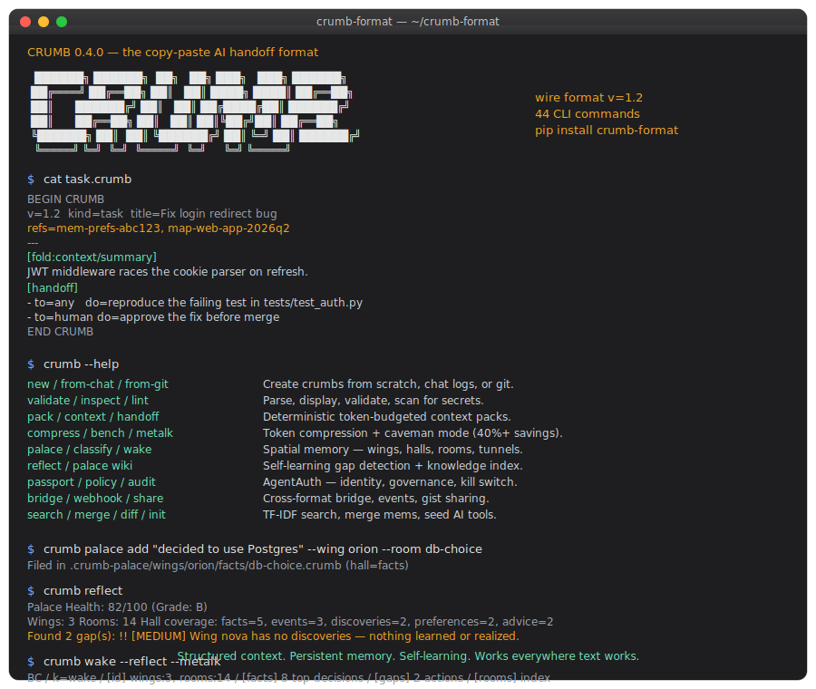

# CRUMB

The copy-paste AI handoff format.



---

Ever been deep into a task with one AI, then need to switch to another? You either paste an enormous chat log and hope it picks up the thread, or you start over and re-explain everything from scratch.

CRUMB is a third option. It's a small, structured text block you copy-paste between AI tools. The next AI gets exactly what it needs to continue your work -- the goal, the context, and the constraints -- without the noise.

> **v0.6.0** — First release on the v1.3 wire format. New `kind=agent` for reusable agent personas; `[handoff]` lines now carry optional `id=`/`after=` dependencies with cycle detection; new sections `[workflow]`, `[checks]`, `[guardrails]`, `[capabilities]`, `[script]`. `[invariants]` extends from `kind=map` to `kind=task`. Structured `deny=`/`require=`/`prefer=` lines inside `[constraints]`. Normative ref resolution (bare id → local dir, `sha256:` → content store, URL opt-in) and normative size-greedy fold selection with optional `fold_priority=` writer override. All additive — a v1.2 parser accepts a v1.3 file by ignoring unknown headers and sections. v0.5.0's efficiency layers (squeeze, sha256 refs, delta crumbs, priority folds) and the full 0.3.0 surface (Palace, Reflect, MeTalk, pack/lint, MemPalace bridge, REST/A2A, AgentAuth, MCP servers, 41+ CLI commands) ship unchanged. `pip install crumb-format`.

## Try it right now

Copy this and paste it into any AI:

```text
BEGIN CRUMB
v=1.1
kind=task
title=Fix login redirect bug
source=cursor.agent
project=web-app
---
[goal]
Fix the bug where authenticated users are redirected back to /login after refresh.

[context]
- App uses JWT cookie auth
- Redirect loop happens only on full page refresh
- Middleware reads auth state before cookie parsing is complete

[constraints]
- Do not change the login UI
- Preserve existing cookie names
- Add a regression check before merging
END CRUMB
```

That's it. The next AI knows what to fix, what it can't change, and why.

## Two real-world scenarios

**Found the bug in Cursor, need Claude to write the test.** Generate a task crumb from Cursor with `crumb it`, paste it into Claude. Claude sees the goal, the surrounding code context, and the constraints -- and writes the test without asking you to re-explain anything.

**Re-explaining your preferences every session?** A mem crumb stores your working style once:

```text
BEGIN CRUMB
v=1.1
kind=mem
title=Builder preferences
source=human.notes
---
[consolidated]
- Prefers direct technical answers with minimal fluff
- Wants copy-pasteable outputs when possible
- Cares about launch speed more than theoretical purity
- Prefers solutions that survive switching between AI tools
END CRUMB
```

Paste it at the start of any session. No more "I like concise answers, don't use emojis, prefer TypeScript..." every time.

Five kinds: `task` (what to do next), `mem` (long-term memory), `map` (repo overview), `log` (session transcript), `todo` (work items).

## How it compares

|                           | Paste raw chat | Start over  | Use CRUMB  |
| ------------------------- | -------------- | ----------- | ---------- |
| Context preserved         | Partial, noisy | None        | Structured |
| Next AI acts immediately  | Unlikely       | No          | Yes        |
| Works across all AI tools | Yes            | Yes         | Yes        |
| Token-efficient           | No             | Yes (lossy) | Yes        |
| Human-readable            | Barely         | N/A         | Yes        |

## v1.2 — handoffs that know about each other

v0.4.0 bumps the format to `v=1.2`. Four additions, all optional, all purely additive. v1.1 parsers accept v1.2 files unchanged.

**Cross-crumb refs** — a CRUMB can now point at other CRUMBs by id, so a task handoff can ride on top of a mem crumb (your style) and a map crumb (the repo layout) without restating them:

```text
v=1.2
kind=task
refs=mem-prefs-abc123, map-web-app-2026q2
```

**Foldable sections** — one section, two lengths. Consumers load `/summary` under token pressure and upgrade to `/full` when budget allows:

```text
[fold:context/summary]
JWT middleware races the cookie parser on refresh.

[fold:context/full]
Full repro + stack trace + 40 lines of investigation...
```

**`[handoff]` primitive** — explicit "next AI do this" block, distinct from `[goal]`:

```text
[handoff]
- to=any    do=reproduce the failing test in tests/test_auth.py
- to=human  do=approve the fix before merge
- [x] reproduced the bug on main@da5e312
```

**Typed content annotations** — tag a section as code, diff, json, or yaml so the next AI renders and parses it correctly:

```text
[context]
@type: code/typescript
export async function requireAuth(req) { ... }
```

See the [v1.2 examples](examples/) (`v12-refs.crumb`, `v12-fold.crumb`, `v12-handoff.crumb`, `v12-typed-content.crumb`), the full [SPEC](SPEC.md) for §§9-12, and two open design docs — [ref resolution](docs/v1.2-ref-resolution.md) and [fold heuristic](docs/v1.2-fold-heuristic.md) — which are now resolved normatively in v1.3 §§17–18.

## v1.3 — agents, dependencies, and closed open questions

v0.6.0 bumps the format to `v=1.3`. Every addition is optional and purely additive — v1.2 parsers accept v1.3 files unchanged by ignoring unknown headers and sections (SPEC §8).

**`kind=agent`** — reusable agent personas. A task crumb can `refs=` an agent crumb to establish persona before processing the work:

```text
BEGIN CRUMB
v=1.3
kind=agent
id=code-reviewer-v2
source=human.notes
---
[identity]
role=senior_reviewer
style=focus_on_edge_cases

[rules]
- never approve without tests

[knowledge]
- expert=python, typescript
END CRUMB
```

**`[handoff]` dependencies** — non-linear graphs without a new section. Optional `id=<token>` and `after=<id>[,...]` on any handoff line; parsers detect cycles and reject unknown deps:

```text
[handoff]
- id=repro   to=any    do=reproduce the failing test
- id=fix     to=any    do=propose a fix                 after=repro
- id=review  to=human  do=approve before merge          after=fix
```

**`[workflow]`** — numbered state machine for orchestration that outgrows `[handoff]`:

```text
[workflow]
1. reproduce_bug    status=pending     owner=any
2. write_test       status=blocked     owner=any      depends_on=1
3. implement_fix    status=blocked     owner=any      depends_on=2
4. human_approval   status=blocked     owner=human    depends_on=3
```

**`[checks]`** — verification results at handoff time, one check per line as `name :: status` with optional `key=value` annotations:

```text
[checks]
- tests.test_auth.py :: pass
- coverage :: 87%      threshold=85
- lint :: fail         note=unused import
```

**`[guardrails]`, `[capabilities]`, `[script]`** — machine-readable policy hints, sender self-description, and opaque executable-intent carriers respectively. Parsers do not enforce or execute; AgentAuth-aware runtimes can consume them.

**Structured `[constraints]`** — optional `deny=`/`require=`/`prefer=`/`why=` lines alongside prose bullets. Prose still works.

**Normative ref resolution (§17)** — bare id → local dir, `sha256:` → content store, URL opt-in, registry opt-in. Depth-5 visited-set cycle handling. `crumb resolve <ref>` is the reference implementation.

**Normative size-greedy fold selection (§18)** — `/summary` is always loaded; `/full` upgrades happen in declaration order (or `fold_priority=` header order) until the budget exhausts.

See the [v1.3 examples](examples/) (`v13-agent.crumb`, `v13-handoff-deps.crumb`, `v13-checks.crumb`, `v13-guardrails.crumb`, `v13-workflow.crumb`, `v13-script.crumb`, `v13-fold-priority.crumb`) and the full [SPEC](SPEC.md) §§17–23.

## New in v0.6.0 — CLI commands

```bash
# Create a reusable agent persona
crumb new agent --agent-id reviewer-v2 --title "Senior reviewer" \
  --source human.notes \
  --rules "never approve without tests" "require regression test" \
  --knowledge "expert=python"

# Resolve a ref the way the spec says to resolve it
crumb resolve reviewer-v2                     # bare id → local dir
crumb resolve sha256:abc123...                 # digest → content store
crumb resolve some-id --walk --depth 5         # walk refs transitively
crumb resolve unknown-id --strict              # exit 1 if unresolved

# Lint with reference resolution checks
crumb lint handoff.crumb --check-refs          # warn on unresolved refs
crumb lint handoff.crumb --check-refs --strict # non-zero on any warning
```

## Add "crumb it" to your AI

Add this to your AI's custom instructions and it generates CRUMBs on command:

```text
When I say "crumb it", generate a CRUMB summarizing the current state.

For tasks: kind=task with [goal], [context], [constraints]
For memory: kind=mem with [consolidated]
For repos: kind=map with [project], [modules]

Format: BEGIN CRUMB / v=1.1 / headers / --- / sections / END CRUMB
```

Works in ChatGPT custom instructions, Claude Projects, Cursor rules, or any AI with system prompts.

## Install

```bash
pip install crumb-format
```

## Quick start

```bash
# create a task crumb
crumb new task --title "Fix auth" --goal "Fix token refresh race condition"

# validate
crumb validate examples/*.crumb

# append observations to memory, then consolidate
crumb append prefs.crumb "Switched to Neovim" "Dropped Redux"
crumb dream prefs.crumb

# search across crumbs (keyword, fuzzy, or TF-IDF ranked)
crumb search "auth JWT" --dir ./crumbs/

# seed all your AI tools at once
crumb init --all
```

Full command reference: `crumb --help` (41 commands including export, import, templates, todos, watch mode, compression, agent governance, and more). See [`docs/QUICKSTART.md`](docs/QUICKSTART.md) for a 5-minute walkthrough.

## Palace — Spatial Memory That Stays With You

AI conversations disappear when the session ends. Palace gives you a persistent, hierarchical memory that any AI can read — organized by **wings** (people/projects), **halls** (facts/events/discoveries/preferences/advice), and **rooms** (specific topics). No database, no cloud — just a directory of `.crumb` files that are grep-able, git-able, and diff-able.

```bash
# Initialize a palace
crumb palace init

# File observations (hall auto-classified if omitted)
crumb palace add "decided to use Postgres" --wing orion --room db-choice
crumb palace add "shipped v0.1 yesterday"  --wing orion --room launch
crumb palace add "prefers concise commits" --wing nova  --room style

# List, search, and cross-reference
crumb palace list --wing orion
crumb palace search "postgres"
crumb palace tunnel                  # find cross-wing links
crumb palace stats

# Wake-up: one-shot context for a new session (~170 tokens)
crumb wake                           # identity + top facts + room index
crumb wake --metalk                  # compressed for token density
```

Auto-classification puts each observation in the right hall without you specifying it — "decided X" → `facts`, "shipped X" → `events`, "prefers X" → `preferences`. Use `crumb classify --text "..."` to test it standalone.

```
.crumb-palace/wings/
  orion/
    facts/db-choice.crumb           # kind=mem
    events/launch.crumb
  nova/
    preferences/style.crumb
    facts/db-choice.crumb           # ← same room name → tunnel detected
```

## Reflect — Self-Learning Gap Detection

A filing cabinet stores what you put in it. A second brain tells you what's _missing_. `crumb reflect` analyzes your palace and identifies knowledge gaps, stale rooms, and imbalances — then suggests exactly what to add next.

```bash
# Health check — scored 0-100 with actionable suggestions
crumb reflect

# Output as a crumb for AI consumption
crumb reflect -f crumb

# Include gap awareness in session wake-ups
crumb wake --reflect

# Generate a structured wiki from palace contents
crumb palace wiki
```

Example output:

```
Palace Health: 76/100 (Grade: C)
Wings: 2  Rooms: 6
Hall coverage: advice=1, discoveries=1, events=1, facts=2, preferences=1

Found 3 gap(s):

   !! [MEDIUM] Wing team has only 1 room(s). Sparse knowledge.
      -> Add more observations: crumb palace add "..." --wing team --room <topic>
    ! [LOW] Wing team is missing hall 'preferences' (present in other wings).
      -> Add to fill the gap: crumb palace add "..." --wing team --hall preferences --room <topic>
    ! [LOW] Wing team has no discoveries — nothing learned or realized.
      -> Capture learnings: crumb palace add "realized ..." --wing team --room <insight>
```

Gap types: empty halls, thin wings, stale rooms (configurable threshold), missing cross-wing halls, undocumented preferences, no discoveries.

## MeTalk — Caveman Compression for AI-to-AI

AI-to-AI messages don't need polished English. MeTalk strips articles, abbreviates tech terms, and shortens verbose phrasing so you can pack more context into the same token budget.

```bash
# Default level 2 (dict + grammar strip, ~40% savings)
crumb metalk task.crumb

# Lossless dictionary substitution only (round-trippable)
crumb metalk task.crumb --level 1

# Aggressive condensing (~50-60% savings)
crumb metalk task.crumb --level 3

# Chain with compress for maximum density
crumb compress task.crumb --metalk
```

Output shows live stats: `MeTalk: 127 → 68 tokens (46.5% saved, 1.87x ratio)`.

## Cross-AI Interop

CRUMB speaks every major AI protocol so your context travels freely between tools.

```bash
# REST API (OpenAPI 3.1) — run as a service
python -m api.server                       # see api/README.md

# Agent-to-Agent (A2A) bridge — Google's A2A spec
python -m a2a.server                       # see a2a/README.md

# Convert CRUMB <-> other formats
crumb bridge list                          # supported formats
crumb bridge export task.crumb --to openai-threads
crumb bridge import chat.json --from langchain-memory

# Event webhooks for agent activity
crumb webhook add https://hooks.example.com/agent-events
crumb webhook test https://hooks.example.com/agent-events
```

Formats supported via `bridge`: `openai-threads`, `langchain-memory`, `crewai-task`, `autogen`, `claude-project`.

## AgentAuth — Agent Identity & Governance

Every AI agent in your org gets a passport. Every tool call gets policy-checked. Every action gets an audit trail. One kill switch revokes everything.

```bash
# Register an agent — issues a cryptographic passport
crumb passport register my-claude-agent --framework langchain --owner alice \
  --tools-allowed "read_*" "search" --tools-denied "delete_*" --ttl-days 90

# Check what an agent is allowed to do
crumb policy set my-claude-agent --allow "read_*" "search" --deny "delete_*"
crumb policy test my-claude-agent read_file    # → ALLOW
crumb policy test my-claude-agent delete_user  # → DENY

# Kill switch — instantly revoke all access
crumb passport revoke ap_abc12345

# Audit trail — every action logged with risk scoring
crumb audit export --format json --agent ap_abc12345
crumb audit feed   # live action stream

# Shadow AI scanner — discover unauthorized agents in your project
crumb scan --path . --min-risk medium
```

**Python SDK** for embedding in your own tools:

```python
from agentauth import AgentPassport, ToolPolicy, CredentialBroker, protect

# Register
mgr = AgentPassport()
result = mgr.register("my-agent", framework="crewai", owner="ops-team")

# Policy gate
policy = ToolPolicy()
policy.set_policy("my-agent", tools_denied=["rm_rf", "drop_table"])

# Decorator — enforces policy before any function runs
@protect(agent_id=result["agent_id"], tool="database.query")
def query_database(sql, _agentauth_credential=None):
    return db.execute(sql)
```

## Integrations

**MCP Server** -- native tool integration with Claude Desktop, Cursor, Claude Code:

```bash
# CRUMB tools (create, validate, search, etc.)
claude mcp add crumb python3 /path/to/crumb-format/mcp/server.py

# AgentAuth tools (passport, policy, audit — 13 tools)
claude mcp add agentauth python3 /path/to/crumb-format/mcp/agentauth_server.py
```

See [`mcp/README.md`](mcp/README.md) for setup.

**Pre-commit hook** -- validate `.crumb` files on every commit:

```yaml
repos:
  - repo: https://github.com/XioAISolutions/crumb-format
    rev: main
    hooks:
      - id: validate-crumbs
```

**ClawHub skill** -- install as an OpenClaw agent skill. See [`clawhub-skill/`](clawhub-skill/).

## What's in this repo

- [`SPEC.md`](SPEC.md) -- the format specification
- [`DREAMING.md`](DREAMING.md) -- how memory consolidation works
- [`docs/QUICKSTART.md`](docs/QUICKSTART.md) -- 5-minute daily workflow guide
- [`examples/`](examples/) -- ready-to-paste `.crumb` files (task, mem, map, log, todo, wake)
- [`cli/crumb.py`](cli/crumb.py) -- full CLI (41 commands)
- [`cli/reflect.py`](cli/reflect.py) -- self-learning gap detection and knowledge health scoring
- [`cli/palace.py`](cli/palace.py) -- Palace spatial memory (wings/halls/rooms/tunnels)
- [`cli/classify.py`](cli/classify.py) -- rule-based hall classifier
- [`cli/metalk.py`](cli/metalk.py) -- MeTalk caveman compression module
- [`agentauth/`](agentauth/) -- AgentAuth SDK (passport, policy, credentials, audit, webhooks)
- [`mcp/`](mcp/) -- MCP servers for CRUMB and AgentAuth
- [`api/`](api/) -- REST API server with OpenAPI 3.1 spec
- [`a2a/`](a2a/) -- Google A2A protocol bridge (agent card, task handler, server)
- [`validators/`](validators/) -- Python and Node reference validators
- [`tests/`](tests/) -- 291 tests covering the full surface area
- [`docs/HANDOFF_PATTERNS.md`](docs/HANDOFF_PATTERNS.md) -- practical handoff patterns

## License

MIT. See [`TRADEMARK.md`](TRADEMARK.md) for brand guidance.

CRUMB is plain text. It works everywhere text works.
