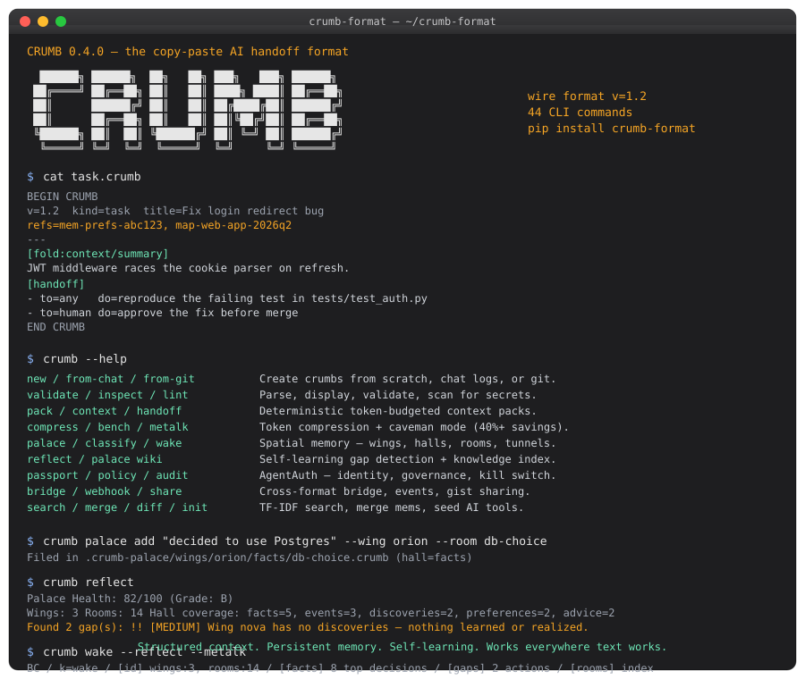

# CRUMB

**Quit Claude Code mid-task, open Cursor or ChatGPT, and keep going — without re-explaining the architecture, the failed approaches, or the open questions.**



---

A raw transcript is the worst possible way to move context between tools: it is optimised for a human replaying a conversation, not for an agent picking up work. CRUMB is a small structured block that carries what the next tool actually needs — the goal, what was diagnosed, the decisions, the files touched, the constraints, and what is still open.

```bash
# Crumb the session you just finished — finds it for you
crumb capture --last
#   crumb capture: .crumb/session-fb203b95.crumb
#   49,489 → 2,403 tokens (95% smaller), 18% fact retention

# Then paste it into whatever you open next.
```

Or let it happen on its own. `install.sh` registers **both** lifecycle hooks, so
the loop closes without anyone remembering any of it:

| Hook | Command | Effect |
| --- | --- | --- |
| `SessionEnd` | `crumb capture` | every session leaves a handoff in `.crumb/` |
| `SessionStart` | `crumb resume` | the next session starts with it already in context |

`crumb resume` injects on a fresh `startup` and after a `compact` — but **not on
`clear`**, because that is the user asking for a clean slate, and restoring the
old context would override an explicit instruction. It skips handoffs older than
a week, states the age of the one it injects, and tells the model to verify
anything load-bearing against the current tree rather than trusting a snapshot.
It cannot fail the session it is attached to: every problem exits 0 with the
reason on stderr.

## Where it reads from

| Source | How |
| --- | --- |
| **Claude Code** | `SessionEnd` + `SessionStart` hooks (automatic, both directions) or `crumb capture --transcript <session>.jsonl` |
| **OpenAI Chat Completions** | `crumb from-messages` — `messages[]`, a bare array, or a response with `choices` |
| **Anthropic Messages API** | content blocks: `text`, `tool_use`, `tool_result`, `thinking` |
| **ChatGPT data export** | `conversations.json` |
| **Claude.ai data export** | `chat_messages` |
| **Cursor** | rules + MCP server (`integrations/cursor/install.sh`) |
| **Anything else** | it is just text — paste it, or hand-write it |

And unlike every other tool in this space, **you can check what it cost you**:

```bash
crumb measure handoff.crumb --source session.jsonl
#   Saved: 88.9% (9.0x smaller)
#   Fact retention: 91.7% (11/12) — broken down by paths, identifiers, urls, error codes
```

Retention is a **lexical** proxy — it reports which load-bearing tokens survived, not whether the next model succeeds. It also falls on very long sessions: a 40-message conversation retains ~92%, while a 1,000-message one retains ~18%, because a 50k-token session genuinely cannot be carried losslessly in a 2.4k handoff. The number is reported as measured rather than tuned, so you can see the trade instead of taking it on trust.

## What compression actually costs

Six strategies, seven transcripts, reproducible in two seconds with no API key
([full writeup](docs/BENCHMARK.md)):

```text
long-claude-code.jsonl  (159 messages)
  strategy                         tokens    saved  retained   example losses
  recency-window-4                    169    95.4%      6.1%   module_00, module_01, module_02
  head-truncate-10                    251    93.2%      6.1%   1200ms, 502, https://…/ledger
  crumb                               547    85.2%     30.5%   module_00, module_01, module_02
  full-transcript                   3,705     0.0%    100.0%   —
```

A structured handoff retains 3–5× more than truncation at comparable
compression — and head-truncation drops the whole diagnosis, because in a real
session the conclusion is at the end.

It does not win everywhere. On tool-heavy sessions, clearing old tool results
retains 62% where CRUMB retains 27%, at a quarter of the compression. That row
is in the benchmark on purpose; a test fails the build if no strategy beats
CRUMB on any axis anywhere.

```bash
python benchmarks/compare.py
```

## Step 1 — Add "crumb it" to your AI (30 seconds, no install)

Paste this into ChatGPT custom instructions, Claude Projects, Cursor rules, or any AI's system prompt:

```text
When I say "crumb it", generate a CRUMB summarizing the current state.

For tasks: kind=task with [goal], [context], [constraints]
For memory: kind=mem with [consolidated]
For repos: kind=map with [project], [modules]
For agent personas: kind=agent with [identity], [rules], [knowledge]

Format: BEGIN CRUMB / v=1.3 / headers / --- / sections / END CRUMB
```

That's the entire setup. Now any time you say `crumb it`, your AI emits a paste-able handoff block you can drop into any other AI.

## Step 2 — Try it (no install, no signup)

Paste this into any AI to see one in action:

```text
BEGIN CRUMB
v=1.3
kind=task
title=Fix login redirect bug
source=cursor.agent
---
[goal]
Fix the bug where authenticated users are redirected back to /login after refresh.

[context]
- App uses JWT cookie auth
- Redirect loop happens only on full page refresh
- Middleware reads auth state before cookie parsing is complete

[constraints]
- Do not change the login UI
- Preserve existing cookie names
- Add a regression check before merging
END CRUMB
```

The next AI knows what to fix, what it can't change, and why. `v=1.1`, `v=1.2`, and `v=1.3` are all accepted — pick whichever your tool emits.

## Two real-world scenarios

**Found the bug in Cursor, need Claude to write the test.** Generate a task crumb from Cursor with `crumb it`, paste it into Claude. Claude sees the goal, code context, and constraints — and writes the test without asking you to re-explain anything.

**Re-explaining your preferences every session?** A mem crumb stores your working style once:

```text
BEGIN CRUMB
v=1.3
kind=mem
title=Builder preferences
source=human.notes
---
[consolidated]
- Prefers direct technical answers with minimal fluff
- Wants copy-pasteable outputs when possible
- Cares about launch speed more than theoretical purity
- Prefers solutions that survive switching between AI tools
END CRUMB
```

Paste it at the start of any session. No more "I like concise answers, don't use emojis, prefer TypeScript..." every time.

Six kinds: `task` (what to do next), `mem` (long-term memory), `map` (repo overview), `log` (session transcript), `todo` (work items), `agent` (reusable persona).

## Optional — install the CLI for power tooling

Everything above works with no install. The CLI is for power users who want to validate, search, lint, pack, or pipeline CRUMBs at scale.

```bash
pip install crumb-format
crumb hello         # 30-second walkthrough — copies a working sample to clipboard
crumb doctor        # check your install
crumb --help        # core commands
crumb --help-all    # full surface (~46 commands grouped by concern)
```

The five core commands cover most workflows:

```bash
crumb new task --title "Fix auth" --goal "Fix token refresh"   # create
crumb validate handoff.crumb                                   # check well-formed
crumb handoff handoff.crumb                                    # copy to clipboard
crumb receive                                                  # read from clipboard
crumb lint handoff.crumb --check-deadlines                     # safety + freshness
```

Run `crumb --help-all` for the full surface (search, palace memory, governance, format bridges, v1.4 features).

## Compress a real conversation — with receipts

`crumb from-messages` reads the formats conversations are actually stored in and turns one into a handoff:

| Input | Shape |
| --- | --- |
| OpenAI Chat Completions | `{"messages": [...]}`, a bare array, or a response with `choices` |
| Anthropic Messages API | content blocks — `text`, `tool_use`, `tool_result`, `thinking` |
| ChatGPT data export | `conversations.json` (mapping tree) |
| Claude.ai data export | `chat_messages` |
| Any of the above | as JSONL |

Run it against the transcript committed in `examples/` — every number below reproduces:

```bash
crumb from-messages -i examples/transcript-checkout-openai.json -o handoff.crumb --stats
```

```text
Read 40 messages as openai-messages.
  3,560 → 394 tokens (89% smaller, 9.0x) via heuristic:chars/4
  Fact retention: 92% (11/12 load-bearing tokens kept)
```

You get a v1.4 task crumb with the goal, what was diagnosed, the decisions that were reached, the files and tools touched, the constraints stated along the way, and the open threads as `[handoff]` items — see [`examples/transcript-checkout.crumb`](examples/transcript-checkout.crumb). Reasoning traces are dropped; they're the most expensive and least reusable part of any transcript. Extraction is deterministic and calls no model, so the same conversation always produces the same crumb.

**And you can check the claim.** `crumb measure` compares a crumb against the source it came from:

```bash
crumb measure examples/transcript-checkout.crumb \
  --source examples/transcript-checkout-openai.json
```

```text
  Tokenizer:         heuristic:chars/4  (approximate — pip install tiktoken for exact counts)
  Source:            3,560 tokens
  CRUMB:             394 tokens
  Saved:             88.9%  (9.0x smaller)
----------------------------------------------------------
  Fact retention:    91.7%  (11/12 load-bearing tokens kept)
    urls           100.0%  (1/1)
    paths           80.0%  (4/5)  lost: next.js
    errors         100.0%  (1/1)
    identifiers    100.0%  (4/4)
    numbers        100.0%  (1/1)
```

That output is the tool working as intended, including the miss. The first run of this fixture scored 58%: it was dropping the diagnosis (`sessionStorage is cleared by the redirect`), the latency, the error code, and the spec URL — carrying the *fix* but not the *why*, so the next model would have had to re-derive it. The extractor was fixed because the measurement showed the loss.

Two numbers, both reproducible. Token counts come from `tiktoken` when it's installed (`pip install crumb-format[measure]`) and from a `chars/4` heuristic when it isn't — and the report always names which one it used, because a compression ratio computed from `len(text) // 4` isn't a measurement.

Retention is a **lexical proxy**: it checks whether load-bearing tokens (paths, URLs, identifiers, error codes, numbers with units) survive compression. It answers "what got dropped", not "does the next model still succeed" — treat it as a regression guard, not a benchmark. The per-category breakdown is the useful part: it tells you *what kind* of information your packing drops.

Wire it into CI so a packing change can't silently start losing context:

```bash
crumb measure handoff.crumb --source conversation.json \
  --min-saved 80 --min-retention 85 --json
```

Exits non-zero when either threshold is missed.

> Compression is not free and the numbers say so. On a short conversation the crumb is *larger* than the source — structure has a fixed cost that only pays back across a long session. `crumb measure` reports that as negative savings rather than hiding it.

## Native integrations — `crumb it` inside your AI tool

Two integrations ship today. Each is a one-line install and gives you a slash command (or rule), MCP server access to all 24 `crumb_*` tools, and the "crumb it" verbal trigger.

**Claude Code:**

```bash
bash <(curl -fsSL https://raw.githubusercontent.com/XioAISolutions/crumb-format/main/integrations/claude-code/install.sh)
```

Adds `/crumb-export` and `/crumb-import` slash commands to your Claude Code sessions. Full doc: [`integrations/claude-code/README.md`](integrations/claude-code/README.md).

**Cursor:**

```bash
bash <(curl -fsSL https://raw.githubusercontent.com/XioAISolutions/crumb-format/main/integrations/cursor/install.sh)
```

Adds CRUMB rule files to your project's `.cursor/rules/` and registers the MCP server globally. Full doc: [`integrations/cursor/README.md`](integrations/cursor/README.md).

Both installers support `--dry-run` to preview every change before writing.

Briefs for Aider and OpenCode integrations live in [`docs/integrations/`](docs/integrations/).

## How it compares

|                           | Paste raw chat | Start over  | Use CRUMB  |
| ------------------------- | -------------- | ----------- | ---------- |
| Context preserved         | Partial, noisy | None        | Structured |
| Next AI acts immediately  | Unlikely       | No          | Yes        |
| Works across all AI tools | Yes            | Yes         | Yes        |
| Token-efficient           | No             | Yes (lossy) | Yes        |
| Human-readable            | Barely         | N/A         | Yes        |

## v1.2 — handoffs that know about each other

v0.4.0 bumps the format to `v=1.2`. Four additions, all optional, all purely additive. v1.1 parsers accept v1.2 files unchanged.

**Cross-crumb refs** — a CRUMB can now point at other CRUMBs by id, so a task handoff can ride on top of a mem crumb (your style) and a map crumb (the repo layout) without restating them:

```text
v=1.2
kind=task
refs=mem-prefs-abc123, map-web-app-2026q2
```

**Foldable sections** — one section, two lengths. Consumers load `/summary` under token pressure and upgrade to `/full` when budget allows:

```text
[fold:context/summary]
JWT middleware races the cookie parser on refresh.

[fold:context/full]
Full repro + stack trace + 40 lines of investigation...
```

**`[handoff]` primitive** — explicit "next AI do this" block, distinct from `[goal]`:

```text
[handoff]
- to=any    do=reproduce the failing test in tests/test_auth.py
- to=human  do=approve the fix before merge
- [x] reproduced the bug on main@da5e312
```

**Typed content annotations** — tag a section as code, diff, json, or yaml so the next AI renders and parses it correctly:

```text
[context]
@type: code/typescript
export async function requireAuth(req) { ... }
```

See the [v1.2 examples](examples/) (`v12-refs.crumb`, `v12-fold.crumb`, `v12-handoff.crumb`, `v12-typed-content.crumb`), the full [SPEC](SPEC.md) for §§9-12, and two open design docs — [ref resolution](docs/v1.2-ref-resolution.md) and [fold heuristic](docs/v1.2-fold-heuristic.md) — which are now resolved normatively in v1.3 §§17–18.

## v1.3 — agents, dependencies, and closed open questions

v0.6.0 bumps the format to `v=1.3`. Every addition is optional and purely additive — v1.2 parsers accept v1.3 files unchanged by ignoring unknown headers and sections (SPEC §8).

**`kind=agent`** — reusable agent personas. A task crumb can `refs=` an agent crumb to establish persona before processing the work:

```text
BEGIN CRUMB
v=1.3
kind=agent
id=code-reviewer-v2
source=human.notes
---
[identity]
role=senior_reviewer
style=focus_on_edge_cases

[rules]
- never approve without tests

[knowledge]
- expert=python, typescript
END CRUMB
```

**`[handoff]` dependencies** — non-linear graphs without a new section. Optional `id=<token>` and `after=<id>[,...]` on any handoff line; parsers detect cycles and reject unknown deps:

```text
[handoff]
- id=repro   to=any    do=reproduce the failing test
- id=fix     to=any    do=propose a fix                 after=repro
- id=review  to=human  do=approve before merge          after=fix
```

**`[workflow]`** — numbered state machine for orchestration that outgrows `[handoff]`:

```text
[workflow]
1. reproduce_bug    status=pending     owner=any
2. write_test       status=blocked     owner=any      depends_on=1
3. implement_fix    status=blocked     owner=any      depends_on=2
4. human_approval   status=blocked     owner=human    depends_on=3
```

**`[checks]`** — verification results at handoff time, one check per line as `name :: status` with optional `key=value` annotations:

```text
[checks]
- tests.test_auth.py :: pass
- coverage :: 87%      threshold=85
- lint :: fail         note=unused import
```

**`[guardrails]`, `[capabilities]`, `[script]`** — machine-readable policy hints, sender self-description, and opaque executable-intent carriers respectively. Parsers do not enforce or execute; AgentAuth-aware runtimes can consume them.

**Structured `[constraints]`** — optional `deny=`/`require=`/`prefer=`/`why=` lines alongside prose bullets. Prose still works.

**Normative ref resolution (§17)** — bare id → local dir, `sha256:` → content store, URL opt-in, registry opt-in. Depth-5 visited-set cycle handling. `crumb resolve <ref>` is the reference implementation.

**Normative size-greedy fold selection (§18)** — `/summary` is always loaded; `/full` upgrades happen in declaration order (or `fold_priority=` header order) until the budget exhausts.

See the [v1.3 examples](examples/) (`v13-agent.crumb`, `v13-handoff-deps.crumb`, `v13-checks.crumb`, `v13-guardrails.crumb`, `v13-workflow.crumb`, `v13-script.crumb`, `v13-fold-priority.crumb`) and the full [SPEC](SPEC.md) §§17–23.

## v1.3 CLI examples

```bash
# Create a reusable agent persona
crumb new agent --agent-id reviewer-v2 --title "Senior reviewer" \
  --source human.notes \
  --rules "never approve without tests" "require regression test" \
  --knowledge "expert=python"

# Resolve a ref the way the spec says to resolve it
crumb resolve reviewer-v2                     # bare id → local dir
crumb resolve sha256:abc123...                 # digest → content store
crumb resolve some-id --walk --depth 5         # walk refs transitively
crumb resolve unknown-id --strict              # exit 1 if unresolved

# Lint with reference resolution checks
crumb lint handoff.crumb --check-refs          # warn on unresolved refs
crumb lint handoff.crumb --check-refs --strict # non-zero on any warning
```

## CLI configuration

Environment variables (all optional, sane defaults):

| Var | Default | Used by |
|-----|---------|---------|
| `CRUMB_HOME` | `~/.crumb/` | local search root for `crumb resolve` |
| `CRUMB_STORE` | `~/.crumb/store/` | content-addressed store for `sha256:` refs |
| `CRUMB_SEEN_FILE` | `~/.crumb/seen` | receiver-side "already-seen" set for `crumb optimize --mode budget` |
| `CRUMB_QUIET` | unset | set to `1` to suppress AgentAuth's first-use storage notice |

Palace lives in `.crumb-palace/` in whichever directory you ran `crumb palace init`. AgentAuth writes to `.crumb-auth/` in the current directory on first use and prints a one-time stderr notice.

## Quick start

```bash
# create a task crumb
crumb new task --title "Fix auth" --goal "Fix token refresh race condition"

# validate
crumb validate examples/*.crumb

# append observations to memory, then consolidate
crumb append prefs.crumb "Switched to Neovim" "Dropped Redux"
crumb dream prefs.crumb

# search across crumbs (keyword, fuzzy, or TF-IDF ranked)
crumb search "auth JWT" --dir ./crumbs/

# seed all your AI tools at once
crumb init --all
```

Full command reference: `crumb --help` (~45 commands grouped by concern: create, inspect, edit, optimize, handoff, memory, governance, format). See [`docs/QUICKSTART.md`](docs/QUICKSTART.md) for a 5-minute walkthrough.

## Palace — Spatial Memory That Stays With You

AI conversations disappear when the session ends. Palace gives you a persistent, hierarchical memory that any AI can read — organized by **wings** (people/projects), **halls** (facts/events/discoveries/preferences/advice), and **rooms** (specific topics). No database, no cloud — just a directory of `.crumb` files that are grep-able, git-able, and diff-able.

```bash
# Initialize a palace
crumb palace init

# File observations (hall auto-classified if omitted)
crumb palace add "decided to use Postgres" --wing orion --room db-choice
crumb palace add "shipped v0.1 yesterday"  --wing orion --room launch
crumb palace add "prefers concise commits" --wing nova  --room style

# List, search, and cross-reference
crumb palace list --wing orion
crumb palace search "postgres"
crumb palace tunnel                  # find cross-wing links
crumb palace stats

# Wake-up: one-shot context for a new session (~170 tokens)
crumb wake                           # identity + top facts + room index
crumb wake --metalk                  # compressed for token density
```

Auto-classification puts each observation in the right hall without you specifying it — "decided X" → `facts`, "shipped X" → `events`, "prefers X" → `preferences`. Use `crumb classify --text "..."` to test it standalone.

```
.crumb-palace/wings/
  orion/
    facts/db-choice.crumb           # kind=mem
    events/launch.crumb
  nova/
    preferences/style.crumb
    facts/db-choice.crumb           # ← same room name → tunnel detected
```

## Reflect — Self-Learning Gap Detection

A filing cabinet stores what you put in it. A second brain tells you what's _missing_. `crumb reflect` analyzes your palace and identifies knowledge gaps, stale rooms, and imbalances — then suggests exactly what to add next.

```bash
# Health check — scored 0-100 with actionable suggestions
crumb reflect

# Output as a crumb for AI consumption
crumb reflect -f crumb

# Include gap awareness in session wake-ups
crumb wake --reflect

# Generate a structured wiki from palace contents
crumb palace wiki
```

Example output:

```
Palace Health: 76/100 (Grade: C)
Wings: 2  Rooms: 6
Hall coverage: advice=1, discoveries=1, events=1, facts=2, preferences=1

Found 3 gap(s):

   !! [MEDIUM] Wing team has only 1 room(s). Sparse knowledge.
      -> Add more observations: crumb palace add "..." --wing team --room <topic>
    ! [LOW] Wing team is missing hall 'preferences' (present in other wings).
      -> Add to fill the gap: crumb palace add "..." --wing team --hall preferences --room <topic>
    ! [LOW] Wing team has no discoveries — nothing learned or realized.
      -> Capture learnings: crumb palace add "realized ..." --wing team --room <insight>
```

Gap types: empty halls, thin wings, stale rooms (configurable threshold), missing cross-wing halls, undocumented preferences, no discoveries.

## MeTalk — Caveman Compression for AI-to-AI

AI-to-AI messages don't need polished English. MeTalk strips articles, abbreviates tech terms, and shortens verbose phrasing so you can pack more context into the same token budget.

```bash
# Default level 2 (dict + grammar strip, ~40% savings)
crumb metalk task.crumb

# Lossless dictionary substitution only (round-trippable)
crumb metalk task.crumb --level 1

# Aggressive condensing (~50-60% savings)
crumb metalk task.crumb --level 3

# Chain with signal compression for maximum density
crumb optimize task.crumb --mode signal --metalk
```

Output shows live stats: `MeTalk: 127 → 68 tokens (46.5% saved, 1.87x ratio)`.

## Cross-AI Interop

CRUMB speaks every major AI protocol so your context travels freely between tools.

```bash
# REST API (OpenAPI 3.1) — run as a service
python -m api.server                       # see api/README.md

# Agent-to-Agent (A2A) bridge — Google's A2A spec
python -m a2a.server                       # see a2a/README.md

# Convert CRUMB <-> other formats
crumb bridge list                          # supported formats
crumb bridge export task.crumb --to openai-threads
crumb bridge import chat.json --from langchain-memory

# Event webhooks for agent activity
crumb webhook add https://hooks.example.com/agent-events
crumb webhook test https://hooks.example.com/agent-events
```

Formats supported via `bridge`: `openai-threads`, `langchain-memory`, `crewai-task`, `autogen`, `claude-project`.

## AgentAuth — Agent Identity & Governance

Every AI agent in your org gets a passport. Every tool call gets policy-checked. Every action gets an audit trail. One kill switch revokes everything.

```bash
# Register an agent — issues a cryptographic passport
crumb passport register my-claude-agent --framework langchain --owner alice \
  --tools-allowed "read_*" "search" --tools-denied "delete_*" --ttl-days 90

# Check what an agent is allowed to do
crumb policy set my-claude-agent --allow "read_*" "search" --deny "delete_*"
crumb policy test my-claude-agent read_file    # → ALLOW
crumb policy test my-claude-agent delete_user  # → DENY

# Kill switch — instantly revoke all access
crumb passport revoke ap_abc12345

# Audit trail — every action logged with risk scoring
crumb audit export --format json --agent ap_abc12345
crumb audit feed   # live action stream

# Shadow AI scanner — discover unauthorized agents in your project
crumb scan --path . --min-risk medium
```

**Python SDK** for embedding in your own tools:

```python
from agentauth import AgentPassport, ToolPolicy, CredentialBroker, protect

# Register
mgr = AgentPassport()
result = mgr.register("my-agent", framework="crewai", owner="ops-team")

# Policy gate
policy = ToolPolicy()
policy.set_policy("my-agent", tools_denied=["rm_rf", "drop_table"])

# Decorator — enforces policy before any function runs
@protect(agent_id=result["agent_id"], tool="database.query")
def query_database(sql, _agentauth_credential=None):
    return db.execute(sql)
```

## Integrations

**MCP Server** -- native tool integration with Claude Desktop, Cursor, Claude Code:

```bash
# CRUMB tools (create, validate, search, etc.)
claude mcp add crumb python3 /path/to/crumb-format/mcp/server.py

# AgentAuth tools (passport, policy, audit — 13 tools)
claude mcp add agentauth python3 /path/to/crumb-format/mcp/agentauth_server.py
```

See [`mcp/README.md`](mcp/README.md) for setup.

**Pre-commit hook** -- validate `.crumb` files on every commit:

```yaml
repos:
  - repo: https://github.com/XioAISolutions/crumb-format
    rev: main
    hooks:
      - id: validate-crumbs
```

**ClawHub skill** -- install as an OpenClaw agent skill. See [`clawhub-skill/`](clawhub-skill/).

## What's in this repo

- [`SPEC.md`](SPEC.md) -- the format specification
- [`DREAMING.md`](DREAMING.md) -- how memory consolidation works
- [`docs/QUICKSTART.md`](docs/QUICKSTART.md) -- 5-minute daily workflow guide
- [`examples/`](examples/) -- ready-to-paste `.crumb` files (task, mem, map, log, todo, wake)
- [`cli/crumb.py`](cli/crumb.py) -- full CLI (~45 commands grouped by concern)
- [`cli/reflect.py`](cli/reflect.py) -- self-learning gap detection and knowledge health scoring
- [`cli/palace.py`](cli/palace.py) -- Palace spatial memory (wings/halls/rooms/tunnels)
- [`cli/classify.py`](cli/classify.py) -- rule-based hall classifier
- [`cli/metalk.py`](cli/metalk.py) -- MeTalk caveman compression module
- [`agentauth/`](agentauth/) -- AgentAuth SDK (passport, policy, credentials, audit, webhooks)
- [`mcp/`](mcp/) -- MCP servers for CRUMB and AgentAuth
- [`api/`](api/) -- REST API server with OpenAPI 3.1 spec
- [`a2a/`](a2a/) -- Google A2A protocol bridge (agent card, task handler, server)
- [`validators/`](validators/) -- Python and Node reference validators
- [`tests/`](tests/) -- 916 tests covering the full surface area
- [`docs/HANDOFF_PATTERNS.md`](docs/HANDOFF_PATTERNS.md) -- practical handoff patterns
- [`crumb_wavelm/`](crumb_wavelm/) -- experimental O(N log N) physics-based language model, **not shipped in the `crumb-format` wheel** ([architecture doc](docs/crumb-llm-architecture.md))

## Crumb LLM (experimental)

**Crumb LLM** is an experimental open-source architecture that replaces
traditional O(N²) transformer attention with physics-based wave equations
at O(N log N) complexity. It's native to the crumb-format ecosystem —
CRUMB sections, priorities, and fold pairs become physical priors on the
wave field rather than being flattened away by a tokenizer.

Each attention head learns three physics scalars (damping α, frequency ω,
phase φ) that shape a wave kernel. Tokens scatter onto a continuous 1-D
field, the kernel propagates information via FFT, and tokens gather back.
Advanced physics include dispersion, boundary conditions (periodic /
absorbing / reflecting), interference mixing, and Gabor wavelet heads.

> **Not part of the format, and not installed with it.** This is research code
> with no bearing on the CRUMB wire format, so it is no longer bundled in the
> `crumb-format` wheel — `pip install crumb-format` does not carry a PyTorch
> model. Build it from a checkout:

```bash
git clone https://github.com/XioAISolutions/crumb-format
cd crumb-format && pip install torch numpy
python -m crumb_wavelm.setup_standalone --output ./crumb-wavelm-pkg

# Train a tiny model on the bundled crumb corpus (~2 min on CPU)
crumb llm train --config tiny --steps 500 --out /tmp/crumb_run

# Generate text
crumb llm generate --ckpt /tmp/crumb_run --prompt "BEGIN CRUMB"

# Score a crumb's perplexity
crumb llm perplexity --ckpt /tmp/crumb_run examples/task-bug-fix.crumb

# Benchmark: Crumb LLM vs transformer at various sequence lengths
crumb llm bench --lens 1024,4096,8192

# See all options
crumb llm info
```

**Scaling:** at 4K tokens Crumb LLM is ~1.5× faster than a
matched-shape transformer; at 8K it's ~2.2× faster. The gap widens
with context length because the wave-field cost is O(F log F)
independent of N, while attention is O(N²).

Full architecture, math, and benchmarks: [`docs/crumb-llm-architecture.md`](docs/crumb-llm-architecture.md).

## License

MIT. See [`TRADEMARK.md`](TRADEMARK.md) for brand guidance.

CRUMB is plain text. It works everywhere text works.
