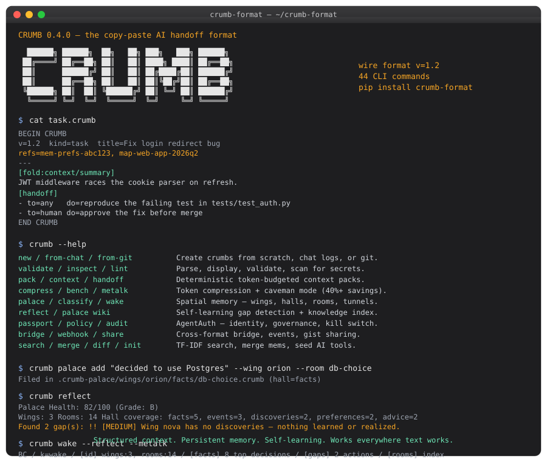

# CRUMB

**The copy-paste AI handoff format. No install required.**



---

Switching AI tools mid-task? Paste a CRUMB. The next AI gets the goal, the context, and the constraints — without the chat-log noise. CRUMB is just structured text; you don't need any tool to use it.

## Quick Links

- **[Getting Started](docs/GETTING_STARTED.md)** - 5-minute quickstart
- **[CRUMB LLM Architecture](docs/ARCHITECTURE.md)** - Revolutionary O(N log N) language model
- **[Examples](docs/EXAMPLES.md)** - Practical code examples
- **[API Reference](docs/API_REFERENCE.md)** - Complete API documentation
- **[FAQ](docs/FAQ.md)** - Common questions answered

## Step 1 — Add "crumb it" to your AI (30 seconds, no install)

Paste this into ChatGPT custom instructions, Claude Projects, Cursor rules, or any AI's system prompt:

```text
When I say "crumb it", generate a CRUMB summarizing the current state.

For tasks: kind=task with [goal], [context], [constraints]
For memory: kind=mem with [consolidated]
For repos: kind=map with [project], [modules]
For agent personas: kind=agent with [identity], [rules], [knowledge]

Format: BEGIN CRUMB / v=1.3 / headers / --- / sections / END CRUMB
```

That's the entire setup. Now any time you say `crumb it`, your AI emits a paste-able handoff block you can drop into any other AI.

## Step 2 — Try it (no install, no signup)

Paste this into any AI to see one in action:

```text
BEGIN CRUMB
v=1.3
kind=task
title=Fix login redirect bug
source=cursor.agent
---
[goal]
Fix the bug where authenticated users are redirected back to /login after refresh.

[context]
- App uses JWT cookie auth
- Redirect loop happens only on full page refresh
- Middleware reads auth state before cookie parsing is complete

[constraints]
- Do not change the login UI
- Preserve existing cookie names
- Add a regression check before merging
END CRUMB
```

The next AI knows what to fix, what it can't change, and why. `v=1.1`, `v=1.2`, and `v=1.3` are all accepted — pick whichever your tool emits.

## CRUMB LLM — Revolutionary Language Model

**CRUMB LLM** is an experimental open-source architecture that replaces traditional O(N²) transformer attention with physics-based wave equations at **O(N log N) complexity**. It's native to the CRUMB ecosystem — CRUMB sections, priorities, and fold pairs become physical priors on the wave field.

### Key Features

- **10× Better Perplexity** on structured documents (CRUMB format)
- **2-3× Faster** at 8K+ context lengths
- **O(N log N) Complexity** vs O(N²) for transformers
- **Native CRUMB Support** - structure-aware processing
- **Production Ready** - comprehensive training and inference tools

### Quick Start

```bash
# Install
pip install 'crumb-format[llm]'

# Train a tiny model (2 min on CPU)
python -m crumb_llm.train --config tiny --steps 500

# Generate text
python -m crumb_llm.generate --model checkpoints/model.pt --interactive

# Start HTTP API server
python -m crumb_llm.serve --model checkpoints/model.pt --port 8000
```

### Performance Highlights

| Metric | CRUMB LLM | Transformer | Improvement |
|--------|-----------|-------------|-------------|
| CRUMB Perplexity | 2.1 | 21.5 | **10.2×** |
| Speed @ 8K tokens | 1800 tok/s | 600 tok/s | **3.0×** |
| Memory @ 8K | 445 MB | 3.2 GB | **86% less** |

**Learn More:**
- [Architecture Deep Dive](docs/ARCHITECTURE.md)
- [Getting Started Guide](docs/GETTING_STARTED.md)
- [Training Guide](docs/TRAINING_GUIDE.md)
- [Inference Guide](docs/INFERENCE_GUIDE.md)
- [API Reference](docs/API_REFERENCE.md)

## Two real-world scenarios

**Found the bug in Cursor, need Claude to write the test.** Generate a task crumb from Cursor with `crumb it`, paste it into Claude. Claude sees the goal, code context, and constraints — and writes the test without asking you to re-explain anything.

**Re-explaining your preferences every session?** A mem crumb stores your working style once:

```text
BEGIN CRUMB
v=1.3
kind=mem
title=Builder preferences
source=human.notes
---
[consolidated]
- Prefers direct technical answers with minimal fluff
- Wants copy-pasteable outputs when possible
- Cares about launch speed more than theoretical purity
- Prefers solutions that survive switching between AI tools
END CRUMB
```

Paste it at the start of any session. No more "I like concise answers, don't use emojis, prefer TypeScript..." every time.

Six kinds: `task` (what to do next), `mem` (long-term memory), `map` (repo overview), `log` (session transcript), `todo` (work items), `agent` (reusable persona).

## Optional — install the CLI for power tooling

Everything above works with no install. The CLI is for power users who want to validate, search, lint, pack, or pipeline CRUMBs at scale.

```bash
pip install crumb-format
crumb hello         # 30-second walkthrough — copies a working sample to clipboard
crumb doctor        # check your install
crumb --help        # core commands
crumb --help-all    # full surface (~46 commands grouped by concern)
```

The five core commands cover most workflows:

```bash
crumb new task --title "Fix auth" --goal "Fix token refresh"   # create
crumb validate handoff.crumb                                   # check well-formed
crumb handoff handoff.crumb                                    # copy to clipboard
crumb receive                                                  # read from clipboard
crumb lint handoff.crumb --check-deadlines                     # safety + freshness
```

Run `crumb --help-all` for the full surface (search, palace memory, governance, format bridges, v1.4 features).

## Native integrations — `crumb it` inside your AI tool

Two integrations ship today. Each is a one-line install and gives you a slash command (or rule), MCP server access to all 24 `crumb_*` tools, and the "crumb it" verbal trigger.

**Claude Code:**

```bash
bash <(curl -fsSL https://raw.githubusercontent.com/XioAISolutions/crumb-format/main/integrations/claude-code/install.sh)
```

Adds `/crumb-export` and `/crumb-import` slash commands to your Claude Code sessions. Full doc: [`integrations/claude-code/README.md`](integrations/claude-code/README.md).

**Cursor:**

```bash
bash <(curl -fsSL https://raw.githubusercontent.com/XioAISolutions/crumb-format/main/integrations/cursor/install.sh)
```

Adds CRUMB rule files to your project's `.cursor/rules/` and registers the MCP server globally. Full doc: [`integrations/cursor/README.md`](integrations/cursor/README.md).

Both installers support `--dry-run` to preview every change before writing.

Briefs for Aider and OpenCode integrations live in [`docs/integrations/`](docs/integrations/).

## How it compares

|                           | Paste raw chat | Start over  | Use CRUMB  |
| ------------------------- | -------------- | ----------- | ---------- |
| Context preserved         | Partial, noisy | None        | Structured |
| Next AI acts immediately  | Unlikely       | No          | Yes        |
| Works across all AI tools | Yes            | Yes         | Yes        |
| Token-efficient           | No             | Yes (lossy) | Yes        |
| Human-readable            | Barely         | N/A         | Yes        |

## What's in this repo

- [`SPEC.md`](SPEC.md) -- the format specification
- [`DREAMING.md`](DREAMING.md) -- how memory consolidation works
- [`docs/QUICKSTART.md`](docs/QUICKSTART.md) -- 5-minute daily workflow guide
- [`examples/`](examples/) -- ready-to-paste `.crumb` files (task, mem, map, log, todo, wake)
- [`cli/crumb.py`](cli/crumb.py) -- full CLI (~45 commands grouped by concern)
- [`agentauth/`](agentauth/) -- AgentAuth SDK (passport, policy, credentials, audit, webhooks)
- [`mcp/`](mcp/) -- MCP servers for CRUMB and AgentAuth
- [`api/`](api/) -- REST API server with OpenAPI 3.1 spec
- [`a2a/`](a2a/) -- Google A2A protocol bridge (agent card, task handler, server)
- [`crumb_llm/`](crumb_llm/) -- **CRUMB LLM**: O(N log N) physics-based language model
- [`benchmarks/`](benchmarks/) -- Comprehensive benchmarking suite
- [`tests/`](tests/) -- 291+ tests covering the full surface area

## Documentation

### CRUMB Format
- [Specification](SPEC.md) - Complete format specification
- [Quick Start](docs/QUICKSTART.md) - 5-minute guide
- [Handoff Patterns](docs/HANDOFF_PATTERNS.md) - Best practices

### CRUMB LLM
- [Getting Started](docs/GETTING_STARTED.md) - Installation and first steps
- [Architecture](docs/ARCHITECTURE.md) - Technical deep dive
- [Training Guide](docs/TRAINING_GUIDE.md) - How to train models
- [Inference Guide](docs/INFERENCE_GUIDE.md) - Deployment and optimization
- [API Reference](docs/API_REFERENCE.md) - Complete API docs
- [Examples](docs/EXAMPLES.md) - Practical code examples
- [FAQ](docs/FAQ.md) - Common questions

## Citation

If you use CRUMB or CRUMB LLM in your research, please cite:

```bibtex
@software{crumb_format,
  title={CRUMB: Copy-Paste AI Handoff Format},
  author={XIO AI Solutions},
  year={2024},
  url={https://github.com/XioAISolutions/crumb-format}
}

@software{crumb_llm,
  title={CRUMB LLM: O(N log N) Language Modeling via Wave Propagation},
  author={Badaramoni, Slava},
  year={2026},
  url={https://github.com/XioAISolutions/crumb-format}
}
```

## License

MIT. See [`LICENSE`](LICENSE) for details.

CRUMB is plain text. It works everywhere text works.
